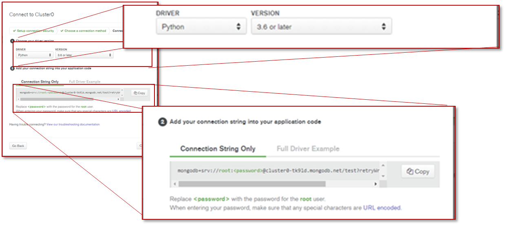

# M13 Assignment: Deploying a MongoDB Instance and Querying Data

## Description

This assignment focuses on setting up simple access to a NoSQL instance of
MongoDB in AWS. For information on python and MongoDB you can read additional
documentation
[here](https://www.mongodb.com/blog/post/getting-started-with-python-and-mongodb).

## Development Activity – Accessing MongoDB Deployment

For this activity, you will create a simple MongoDB cluster and query the sample
databases for results. Here are the steps you should follow to establish your
environment:

### Part I. Create MongoDB Instance 

-   Create a MongoDB Atlas Cloud instance in Free Tier AWS following the
    instructions [here](https://docs.atlas.mongodb.com/getting-started/).

-   Once created, set up the following:

    -   Whitelist you IP Address (remember this is in the cloud and you will
        need to ensure access the same way you have previous with AWS RDS)

    -   Database access (i.e., create an account, etc.)

    -   Load Sample Datasets (in particular, we will be using the sample_airbnb
        sample set)

    -   Next, navigate to your Cluster and selection ‘Connect’. Get the
        connection string for an application connection. In the example, I am
        using Python 3.7 and I copy that connection string.

        

### Part II. Querying your MongoDB Instance from Python

Now that you have set up your MongoDB instance, you will need to connect to your
instance via Python. Please use the sample code in the following file to assist
you in connecting to your MongoDB instance:

    ```./scripts/connect-to-mongo.py```	

Once you have read through some of the documentation and connected to your
database, please answer the following questions and follow the instructions in
finishing your assignment.

-   Provide the results of your connection string by running the following
    function, printing the results and adding them to your response for this
    question

    ```db = client.sample_airbnb 
    serverStatusResult=db.command("serverStatus")
    print(serverStatusResult)```

-   Now briefly profile the dataset. Provide a response to the following:

    -   How many documents are in the dataset?

    -   What is the average size of the documents?

    -   What is the size of the database?

-   Now run queries to answer the following:

    -   How many listings were reviewed on 2016-01-31 in the listingsAndReviews
        collection?

    -   What is the property_type of the \_id =’10084023’?

    -   How many listings have a property_type = ‘house’?

Please submit your assignment as separate documents in the Canvas Portal. You
will need to provide your query and results in each response. These can be
either .py files or .txt files. If you are unable to submit via canvas, you can
email me directly at <brandon.chiazza@yu.edu>. Please use the following
conventions for submissions:

-   \<\<task
    no\>\>_\<\<Last_Name\>\>_\<\<First_Name\>\>_\<\<YU_Student_ID\>\>_M13_Assignment
